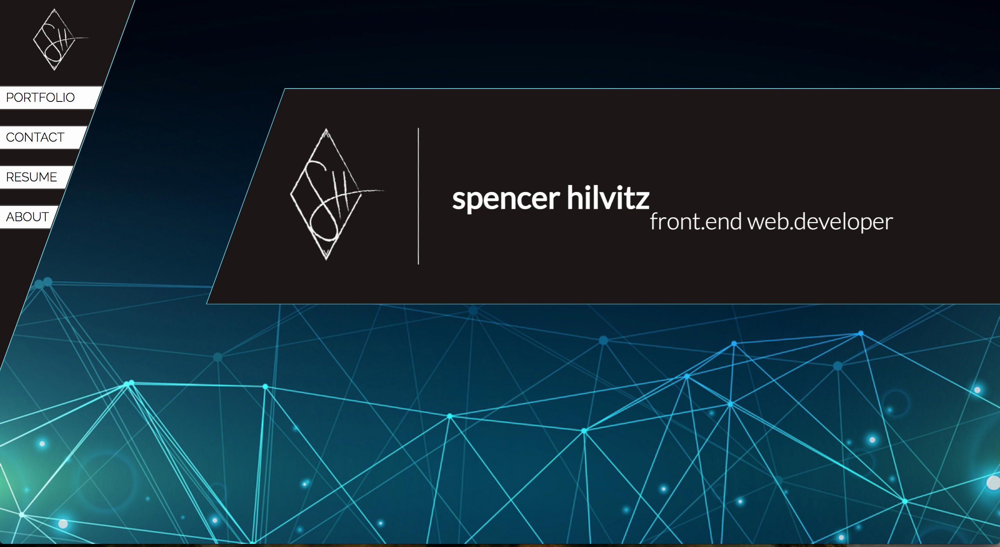
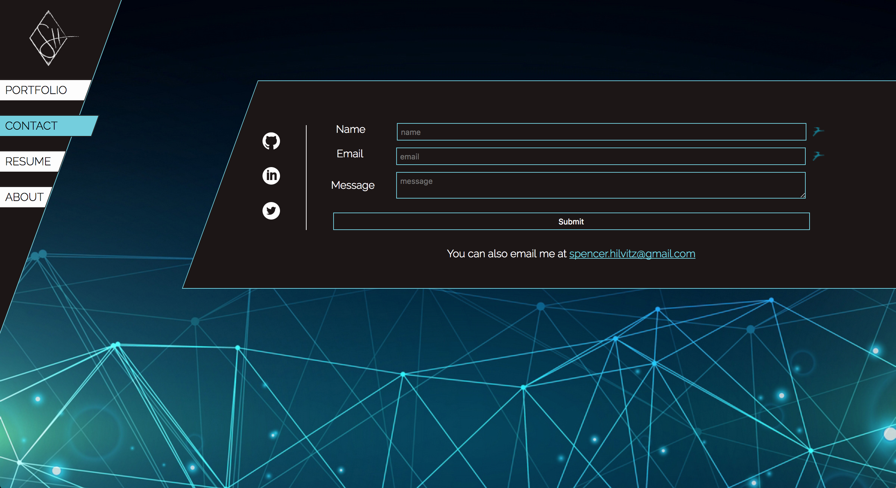
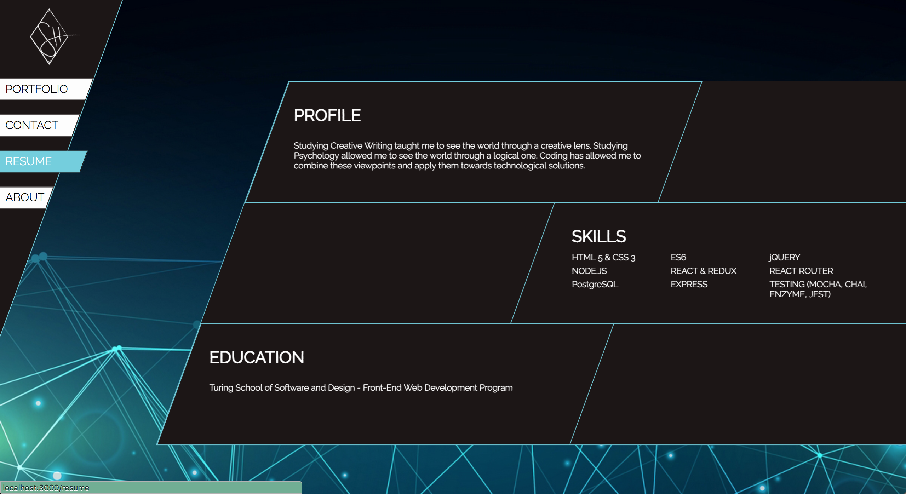
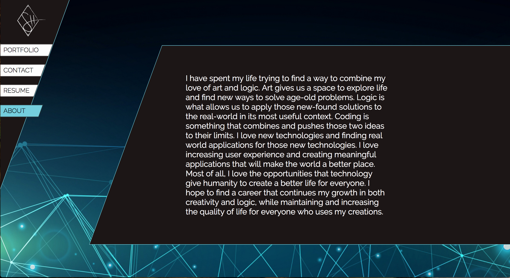

# spencerhilvitz.com
My personal site was build using React and Router4.

This project was bootstrapped with [Create React App](https://github.com/facebookincubator/create-react-app).

## Project Status
The site is live at [www.spencerhilvitz.com](www.spencerhilvitz.com)

## Project Screen Shots

## Future Iterations

I would like to make the site responsive and change the design on smaller screen sizes.
